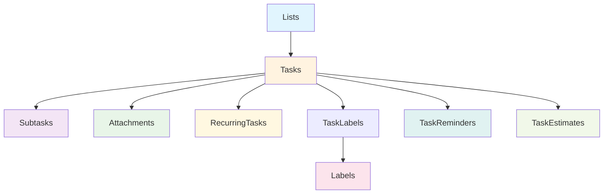

# Database Schema Design (SQLite with Drizzle ORM)

## Overview

This document defines the database schema for the Next.js daily task planner application using SQLite with Drizzle ORM. The schema is designed to support all required features including lists, tasks with extensive properties, labels, subtasks, attachments, and recurring tasks.

## Database Configuration

### SQLite Setup

- **Database**: SQLite (local file-based)
- **ORM**: Drizzle ORM
- **Migration Tool**: Drizzle Kit
- **File Location**: `./data/app.db`

### Connection Configuration

```typescript
// lib/db/index.ts
import { drizzle } from "drizzle-orm/better-sqlite3";
import Database from "better-sqlite3";

const sqlite = new Database("data/app.db");
export const db = drizzle(sqlite);
```

## Entity Relationships



## Schema Definitions

### 1. Lists Table

```typescript
// lib/db/schema.ts
import {
  sqliteTable,
  text,
  integer,
  primaryKey,
} from "drizzle-orm/sqlite-core";

export const lists = sqliteTable("lists", {
  id: text("id").primaryKey(),
  name: text("name").notNull(),
  description: text("description"),
  color: text("color").notNull().default("#3B82F6"), // Hex color
  emoji: text("emoji"),
  isDefault: text("is_default", {
    enum: ["inbox", "today", "upcoming", "all"],
  }),
  createdAt: integer("created_at", { mode: "timestamp" }).notNull(),
  updatedAt: integer("updated_at", { mode: "timestamp" }).notNull(),
  order: integer("order").notNull().default(0),
});
```

**Fields:**

- `id`: Unique identifier (UUID)
- `name`: List name (required)
- `description`: Optional list description
- `color`: Hex color code for list theming
- `emoji`: Optional emoji for visual identification
- `isDefault`: Type for system lists (inbox, today, upcoming, all)
- `createdAt`: Creation timestamp
- `updatedAt`: Last update timestamp
- `order`: Sort order for custom lists

### 2. Tasks Table

```typescript
export const tasks = sqliteTable("tasks", {
  id: text("id").primaryKey(),
  title: text("title").notNull(),
  description: text("description"),

  // Date fields
  startDate: integer("start_date", { mode: "timestamp" }),
  dueDate: integer("due_date", { mode: "timestamp" }),
  completedAt: integer("completed_at", { mode: "timestamp" }),

  // Status and priority
  status: text("status", { enum: ["pending", "in_progress", "completed"] })
    .notNull()
    .default("pending"),
  priority: text("priority", { enum: ["low", "medium", "high", "urgent"] })
    .notNull()
    .default("medium"),

  // Time tracking
  estimatedTime: integer("estimated_time"), // in minutes
  actualTime: integer("actual_time"), // in minutes

  // List relationship
  listId: text("list_id").references(() => lists.id),

  // Parent task for subtasks
  parentId: text("parent_id").references(() => tasks.id),

  // Recurring task flag
  isRecurring: integer("is_recurring", { mode: "boolean" })
    .notNull()
    .default(false),

  // Completion tracking
  isCompleted: integer("is_completed", { mode: "boolean" })
    .notNull()
    .default(false),

  // Order within list
  order: integer("order").notNull().default(0),

  // Timestamps
  createdAt: integer("created_at", { mode: "timestamp" }).notNull(),
  updatedAt: integer("updated_at", { mode: "timestamp" }).notNull(),
});
```

**Fields:**

- `id`: Unique identifier (UUID)
- `title`: Task title (required)
- `description`: Optional detailed description
- `startDate`: When task becomes active
- `dueDate`: Task deadline
- `completedAt`: Completion timestamp
- `status`: Task status (pending, in_progress, completed)
- `priority`: Task priority (low, medium, high, urgent)
- `estimatedTime`: Estimated completion time in minutes
- `actualTime`: Actual time spent in minutes
- `listId`: Foreign key to lists table
- `parentId`: Self-reference for subtasks
- `isRecurring`: Flag for recurring tasks
- `isCompleted`: Completion status
- `order`: Sort order within list
- `createdAt/updatedAt`: Timestamps

### 3. Labels Table

```typescript
export const labels = sqliteTable("labels", {
  id: text("id").primaryKey(),
  name: text("name").notNull(),
  color: text("color").notNull(),
  description: text("description"),
  createdAt: integer("created_at", { mode: "timestamp" }).notNull(),
  updatedAt: integer("updated_at", { mode: "timestamp" }).notNull(),
});
```

### 4. Task Labels (Many-to-Many)

```typescript
export const taskLabels = sqliteTable(
  "task_labels",
  {
    taskId: text("task_id").references(() => tasks.id),
    labelId: text("label_id").references(() => labels.id),
  },
  (table) => ({
    pk: primaryKey(table.taskId, table.labelId),
  })
);
```

### 5. Subtasks Table

```typescript
export const subtasks = sqliteTable("subtasks", {
  id: text("id").primaryKey(),
  taskId: text("task_id").references(() => tasks.id),
  title: text("title").notNull(),
  isCompleted: integer("is_completed", { mode: "boolean" })
    .notNull()
    .default(false),
  order: integer("order").notNull().default(0),
  createdAt: integer("created_at", { mode: "timestamp" }).notNull(),
  updatedAt: integer("updated_at", { mode: "timestamp" }).notNull(),
});
```

### 6. Attachments Table

```typescript
export const attachments = sqliteTable("attachments", {
  id: text("id").primaryKey(),
  taskId: text("task_id").references(() => tasks.id),
  fileName: text("file_name").notNull(),
  filePath: text("file_path").notNull(),
  fileSize: integer("file_size").notNull(), // in bytes
  mimeType: text("mime_type").notNull(),
  originalName: text("original_name").notNull(),
  createdAt: integer("created_at", { mode: "timestamp" }).notNull(),
});
```

### 7. Reminders Table

```typescript
export const reminders = sqliteTable("reminders", {
  id: text("id").primaryKey(),
  taskId: text("task_id").references(() => tasks.id),
  reminderTime: integer("reminder_time", { mode: "timestamp" }).notNull(),
  isSent: integer("is_sent", { mode: "boolean" }).notNull().default(false),
  createdAt: integer("created_at", { mode: "timestamp" }).notNull(),
});
```

### 8. Task Estimates Table

```typescript
export const taskEstimates = sqliteTable("task_estimates", {
  id: text("id").primaryKey(),
  taskId: text("task_id").references(() => tasks.id),
  estimatedTime: integer("estimated_time").notNull(), // in minutes
  actualTime: integer("actual_time"), // in minutes
  createdAt: integer("created_at", { mode: "timestamp" }).notNull(),
});
```

### 9. Recurring Tasks Table

```typescript
export const recurringTasks = sqliteTable("recurring_tasks", {
  id: text("id").primaryKey(),
  taskId: text("task_id").references(() => tasks.id),
  frequency: text("frequency", {
    enum: ["daily", "weekly", "monthly", "yearly"],
  }).notNull(),
  interval: integer("interval").notNull().default(1), // e.g., every 2 weeks
  endDate: integer("end_date", { mode: "timestamp" }), // when to stop recurring
  lastGeneratedDate: integer("last_generated_date", { mode: "timestamp" }),
  createdAt: integer("created_at", { mode: "timestamp" }).notNull(),
  updatedAt: integer("updated_at", { mode: "timestamp" }).notNull(),
});
```

## Indexes and Constraints

### Primary Keys

- All tables use UUID strings as primary keys
- Composite primary keys for many-to-many relationships

### Foreign Key Constraints

```sql
-- Enable foreign key constraints
PRAGMA foreign_keys = ON;

-- Cascade deletes for related records
-- When a task is deleted, related subtasks, attachments, reminders are also deleted
```

### Indexes

```typescript
// Performance indexes
export const indexes = {
  // Fast task lookup by list
  tasks_list_id_idx: index("tasks_list_id_idx").on(tasks.listId),

  // Fast task lookup by due date
  tasks_due_date_idx: index("tasks_due_date_idx").on(tasks.dueDate),

  // Fast task lookup by status
  tasks_status_idx: index("tasks_status_idx").on(tasks.status),

  // Fast task lookup by priority
  tasks_priority_idx: index("tasks_priority_idx").on(tasks.priority),

  // Fast task lookup by completion status
  tasks_is_completed_idx: index("tasks_is_completed_idx").on(tasks.isCompleted),

  // Fast reminder lookup
  reminders_task_id_idx: index("reminders_task_id_idx").on(reminders.taskId),
  reminders_reminder_time_idx: index("reminders_reminder_time_idx").on(
    reminders.reminderTime
  ),

  // Fast attachment lookup
  attachments_task_id_idx: index("attachments_task_id_idx").on(
    attachments.taskId
  ),
};
```

## Data Integrity

### Check Constraints

```typescript
// Ensure estimated time is positive
// Ensure file size is positive
// Ensure order values are non-negative
// Ensure dates are logical (start before due, etc.)
```

### Unique Constraints

- List names within custom lists (not for default lists)
- Task titles within a list (optional, can be relaxed)

## Migration Strategy

### Initial Migration

```typescript
// drizzle/0001_initial_schema.sql
-- Create all tables with proper constraints
-- Add indexes for performance
-- Insert default lists (Inbox, Today, Upcoming, All)
```

### Future Migrations

- Version-controlled migration files
- Backward compatibility considerations
- Data migration scripts when needed

## Query Patterns

### Common Queries

```typescript
// Get all tasks for a list with labels and subtasks
const getTasksWithRelations = (listId: string) => {
  return db.query.tasks.findMany({
    where: eq(tasks.listId, listId),
    with: {
      labels: true,
      subtasks: true,
      attachments: true,
    },
    orderBy: [tasks.order, tasks.createdAt],
  });
};

// Get tasks by date range
const getTasksByDateRange = (startDate: Date, endDate: Date) => {
  return db.query.tasks.findMany({
    where: and(
      gte(tasks.dueDate, startDate),
      lte(tasks.dueDate, endDate),
      eq(tasks.isCompleted, false)
    ),
  });
};

// Get overdue tasks
const getOverdueTasks = () => {
  return db.query.tasks.findMany({
    where: and(lt(tasks.dueDate, new Date()), eq(tasks.isCompleted, false)),
    orderBy: [tasks.priority, tasks.dueDate],
  });
};
```

## Performance Considerations

### Optimization Strategies

1. **Indexing**: Proper indexes on frequently queried fields
2. **Pagination**: Limit result sets for large datasets
3. **Lazy Loading**: Load related data only when needed
4. **Caching**: Implement query result caching
5. **Database Size**: Regular cleanup of old data

### Query Optimization

- Use `SELECT` specific fields instead of `SELECT *`
- Implement pagination for large result sets
- Use efficient JOIN operations
- Consider materialized views for complex aggregations

## Backup and Recovery

### Backup Strategy

- Automatic daily backups
- Cloud storage for backup files
- Versioned backup system

### Recovery Plan

- Point-in-time recovery capability
- Data validation after recovery
- Rollback procedures for failed migrations

This database schema provides a solid foundation for the task planner application, supporting all required features while maintaining data integrity and performance.
