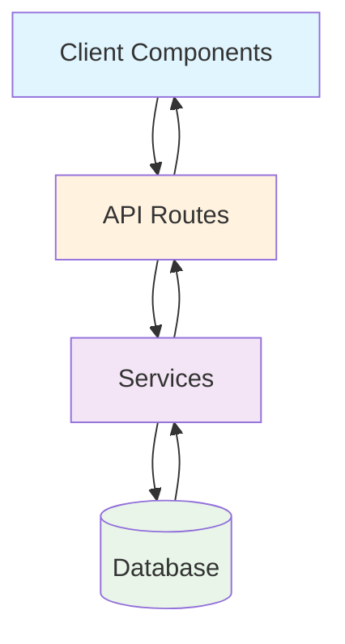
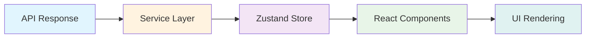

# API Endpoints and Data Flow Architecture

## Overview

This document defines the API endpoints and data flow architecture for the Next.js daily task planner application. The API follows REST principles and is designed to support all application features while maintaining performance and scalability.

## API Architecture Principles

### 1. RESTful Design

- Resource-based URLs
- HTTP methods for operations (GET, POST, PUT, DELETE)
- Consistent response formats
- Proper HTTP status codes

### 2. Performance Optimization

- Efficient database queries
- Pagination for large datasets
- Caching strategies
- Lazy loading of related data

### 3. Error Handling

- Consistent error response format
- Proper HTTP status codes
- Detailed error messages
- Client-side error handling

### 4. Security

- Input validation and sanitization
- Rate limiting
- CORS configuration
- SQL injection prevention

## API Endpoint Structure

### Base URL

```
/api/v1/
```

### Response Format

```typescript
interface ApiResponse<T> {
  success: boolean;
  data?: T;
  error?: {
    code: string;
    message: string;
    details?: any;
  };
  meta?: {
    total?: number;
    page?: number;
    limit?: number;
    totalPages?: number;
  };
}
```

## Lists API Endpoints

### 1. Get All Lists

```http
GET /api/v1/lists
```

**Query Parameters:**

- `includeDefault` (boolean): Include system default lists
- `sortBy` (string): Sort field (name, createdAt, order)
- `sortOrder` (string): Sort direction (asc, desc)

**Response:**

```typescript
interface GetListsResponse {
  success: boolean;
  data: List[];
  meta: {
    total: number;
  };
}
```

**Implementation:**

```typescript
// app/api/lists/route.ts
export async function GET(request: Request) {
  const { searchParams } = new URL(request.url);
  const includeDefault = searchParams.get("includeDefault") === "true";
  const sortBy = searchParams.get("sortBy") || "order";
  const sortOrder = searchParams.get("sortOrder") || "asc";

  try {
    const lists = await listService.getAllLists({
      includeDefault,
      sortBy,
      sortOrder,
    });

    return Response.json({
      success: true,
      data: lists,
      meta: { total: lists.length },
    });
  } catch (error) {
    return Response.json(
      {
        success: false,
        error: {
          code: "LISTS_FETCH_ERROR",
          message: "Failed to fetch lists",
          details: error,
        },
      },
      { status: 500 }
    );
  }
}
```

### 2. Create New List

```http
POST /api/v1/lists
```

**Request Body:**

```typescript
interface CreateListRequest {
  name: string;
  description?: string;
  color?: string;
  emoji?: string;
}
```

**Response:**

```typescript
interface CreateListResponse {
  success: boolean;
  data: List;
}
```

**Implementation:**

```typescript
export async function POST(request: Request) {
  try {
    const body = await request.json();
    const validatedData = createListSchema.parse(body);

    const newList = await listService.createList(validatedData);

    return Response.json(
      {
        success: true,
        data: newList,
      },
      { status: 201 }
    );
  } catch (error) {
    if (error instanceof z.ZodError) {
      return Response.json(
        {
          success: false,
          error: {
            code: "VALIDATION_ERROR",
            message: "Invalid input data",
            details: error.errors,
          },
        },
        { status: 400 }
      );
    }

    return Response.json(
      {
        success: false,
        error: {
          code: "LIST_CREATION_ERROR",
          message: "Failed to create list",
        },
      },
      { status: 500 }
    );
  }
}
```

### 3. Get List by ID

```http
GET /api/v1/lists/:listId
```

**Query Parameters:**

- `includeTasks` (boolean): Include tasks in response
- `includeCompleted` (boolean): Include completed tasks
- `page` (number): Page number for pagination
- `limit` (number): Items per page

**Response:**

```typescript
interface GetListResponse {
  success: boolean;
  data: List & {
    tasks?: Task[];
  };
  meta?: {
    total: number;
    page: number;
    limit: number;
    totalPages: number;
  };
}
```

### 4. Update List

```http
PUT /api/v1/lists/:listId
```

**Request Body:**

```typescript
interface UpdateListRequest {
  name?: string;
  description?: string;
  color?: string;
  emoji?: string;
  order?: number;
}
```

### 5. Delete List

```http
DELETE /api/v1/lists/:listId
```

**Response:**

```typescript
interface DeleteListResponse {
  success: boolean;
  data: {
    deletedId: string;
    deletedCount: number;
  };
}
```

## Tasks API Endpoints

### 1. Get Tasks

```http
GET /api/v1/tasks
```

**Query Parameters:**

- `listId` (string): Filter by list ID
- `status` (string): Filter by status (pending, in_progress, completed)
- `priority` (string): Filter by priority (low, medium, high, urgent)
- `dueDateFrom` (string): Filter tasks due after date
- `dueDateTo` (string): Filter tasks due before date
- `search` (string): Search in title and description
- `labels` (string[]): Filter by label IDs
- `page` (number): Page number
- `limit` (number): Items per page
- `sortBy` (string): Sort field
- `sortOrder` (string): Sort direction

**Response:**

```typescript
interface GetTasksResponse {
  success: boolean;
  data: Task[];
  meta: {
    total: number;
    page: number;
    limit: number;
    totalPages: number;
  };
}
```

### 2. Create Task

```http
POST /api/v1/tasks
```

**Request Body:**

```typescript
interface CreateTaskRequest {
  title: string;
  description?: string;
  listId: string;
  startDate?: string;
  dueDate?: string;
  priority?: "low" | "medium" | "high" | "urgent";
  estimatedTime?: number;
  labels?: string[];
  reminders?: {
    reminderTime: string;
  }[];
  subtasks?: {
    title: string;
    order: number;
  }[];
  isRecurring?: boolean;
  recurringConfig?: {
    frequency: "daily" | "weekly" | "monthly" | "yearly";
    interval: number;
    endDate?: string;
  };
}
```

### 3. Get Task by ID

```http
GET /api/v1/tasks/:taskId
```

**Query Parameters:**

- `includeRelations` (boolean): Include related data (labels, subtasks, attachments, reminders)

**Response:**

```typescript
interface GetTaskResponse {
  success: boolean;
  data: Task & {
    labels: Label[];
    subtasks: Subtask[];
    attachments: Attachment[];
    reminders: Reminder[];
  };
}
```

### 4. Update Task

```http
PUT /api/v1/tasks/:taskId
```

**Request Body:**

```typescript
interface UpdateTaskRequest {
  title?: string;
  description?: string;
  listId?: string;
  startDate?: string;
  dueDate?: string;
  status?: "pending" | "in_progress" | "completed";
  priority?: "low" | "medium" | "high" | "urgent";
  estimatedTime?: number;
  actualTime?: number;
  isCompleted?: boolean;
  labels?: string[];
  order?: number;
}
```

### 5. Delete Task

```http
DELETE /api/v1/tasks/:taskId
```

### 6. Complete Task

```http
PATCH /api/v1/tasks/:taskId/complete
```

**Request Body:**

```typescript
interface CompleteTaskRequest {
  actualTime?: number;
  completionNotes?: string;
}
```

### 7. Update Task Status

```http
PATCH /api/v1/tasks/:taskId/status
```

**Request Body:**

```typescript
interface UpdateTaskStatusRequest {
  status: "pending" | "in_progress" | "completed";
}
```

## Search API Endpoints

### 1. Global Search

```http
GET /api/v1/search
```

**Query Parameters:**

- `q` (string): Search query
- `types` (string[]): Search types (tasks, lists, labels)
- `listId` (string): Limit search to specific list
- `page` (number): Page number
- `limit` (number): Items per page

**Response:**

```typescript
interface SearchResponse {
  success: boolean;
  data: {
    tasks: Task[];
    lists: List[];
    labels: Label[];
  };
  meta: {
    total: number;
    page: number;
    limit: number;
  };
}
```

### 2. Advanced Search

```http
POST /api/v1/search/advanced
```

**Request Body:**

```typescript
interface AdvancedSearchRequest {
  query: string;
  filters: {
    lists?: string[];
    priorities?: string[];
    statuses?: string[];
    dueDateRange?: {
      from?: string;
      to?: string;
    };
    labels?: string[];
    hasAttachments?: boolean;
    hasReminders?: boolean;
  };
  sortBy: string;
  sortOrder: "asc" | "desc";
  page: number;
  limit: number;
}
```

## Attachments API Endpoints

### 1. Upload Attachment

```http
POST /api/v1/attachments
```

**Request:**

- Multi-part form data with file
- `taskId` (string): Task ID
- `description` (string, optional): File description

**Response:**

```typescript
interface UploadAttachmentResponse {
  success: boolean;
  data: Attachment;
}
```

### 2. Get Attachments for Task

```http
GET /api/v1/attachments/task/:taskId
```

### 3. Delete Attachment

```http
DELETE /api/v1/attachments/:attachmentId
```

### 4. Download Attachment

```http
GET /api/v1/attachments/:attachmentId/download
```

## Labels API Endpoints

### 1. Get All Labels

```http
GET /api/v1/labels
```

### 2. Create Label

```http
POST /api/v1/labels
```

### 3. Update Label

```http
PUT /api/v1/labels/:labelId
```

### 4. Delete Label

```http
DELETE /api/v1/labels/:labelId
```

### 5. Get Tasks by Label

```http
GET /api/v1/labels/:labelId/tasks
```

## Data Flow Architecture

### 1. Client-Server Communication



### 2. Request Flow

```
Client Request
    ↓
API Route Handler
    ↓
Input Validation (Zod)
    ↓
Service Layer
    ↓
Database Operations
    ↓
Response Formatting
    ↓
Client Response
```

### 3. State Management Integration



## Error Handling Strategy

### 1. HTTP Status Codes

- `200`: Success
- `201`: Created
- `400`: Bad Request
- `401`: Unauthorized
- `403`: Forbidden
- `404`: Not Found
- `422`: Validation Error
- `500`: Internal Server Error

### 2. Error Response Format

```typescript
interface ErrorResponse {
  success: boolean;
  error: {
    code: string;
    message: string;
    details?: any;
  };
}
```

### 3. Client-Side Error Handling

```typescript
// lib/api/client.ts
export const apiClient = {
  async get<T>(url: string, options?: RequestInit): Promise<T> {
    try {
      const response = await fetch(url, {
        ...options,
        headers: {
          "Content-Type": "application/json",
          ...options?.headers,
        },
      });

      if (!response.ok) {
        throw new ApiError(response.status, response.statusText);
      }

      const data = await response.json();

      if (!data.success) {
        throw new ApiError(500, data.error?.message || "Request failed");
      }

      return data.data;
    } catch (error) {
      console.error("API Error:", error);
      throw error;
    }
  },
};
```

## Caching Strategy

### 1. Client-Side Caching

- Zustand store for state management
- React Query for server state (if needed)
- Memoization for expensive calculations

### 2. Server-Side Caching

- Next.js built-in caching
- Redis for distributed caching (future enhancement)
- Database query caching

### 3. Cache Invalidation

- On data mutations (create, update, delete)
- Time-based expiration
- Event-driven invalidation

## Performance Optimization

### 1. Database Optimization

- Proper indexing
- Query optimization
- Pagination
- Lazy loading

### 2. API Optimization

- Efficient data fetching
- Compression
- CDN for static assets
- Rate limiting

### 3. Client Optimization

- Lazy loading of components
- Virtualization for long lists
- Image optimization
- Bundle splitting

## Security Considerations

### 1. Input Validation

- Zod schema validation
- Type checking
- Sanitization

### 2. Authentication

- API key validation (if needed)
- CORS configuration
- CSRF protection

### 3. Data Protection

- SQL injection prevention
- XSS protection
- File upload validation
