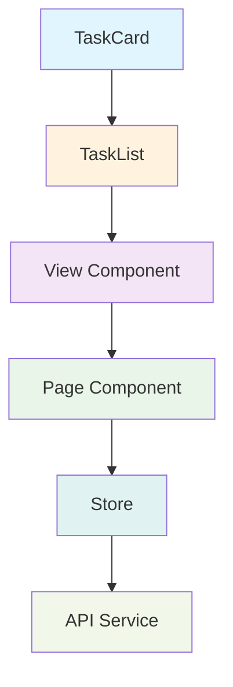

# Component Architecture

## Overview

This document defines the component architecture for the Next.js daily task planner application. The architecture follows modern React patterns with a focus on reusability, maintainability, and scalability.

## Architecture Principles

### 1. Component Hierarchy

- **Atomic Design System**: Atoms → Molecules → Organisms → Templates → Pages
- **Single Responsibility**: Each component has one clear purpose
- **Reusability**: Components are designed for reuse across the application
- **Composability**: Components can be combined to create complex UIs

### 2. Design Patterns

- **Container/Presentational**: Separation of data fetching and UI rendering
- **Higher-Order Components**: For cross-cutting concerns
- **Render Props**: For flexible component composition
- **Custom Hooks**: For reusable logic

### 3. Styling Approach

- **Tailwind CSS**: Utility-first CSS framework
- **Component-Level Styles**: Scoped styles using CSS Modules
- **Theme System**: Consistent color and spacing scales
- **Responsive Design**: Mobile-first approach

## Component Structure

### 1. UI Components (Atoms)

#### Button Component

```tsx
// components/ui/Button.tsx
import React from "react";
import { cva, type VariantProps } from "class-variance-authority";
import { cn } from "@/lib/utils";

const buttonVariants = cva(
  "inline-flex items-center justify-center rounded-md text-sm font-medium transition-colors focus-visible:outline-none focus-visible:ring-2 focus-visible:ring-ring focus-visible:ring-offset-2 disabled:opacity-50 disabled:pointer-events-none ring-offset-background",
  {
    variants: {
      variant: {
        default: "bg-primary text-primary-foreground hover:bg-primary/90",
        destructive:
          "bg-destructive text-destructive-foreground hover:bg-destructive/90",
        outline:
          "border border-input bg-background hover:bg-accent hover:text-accent-foreground",
        secondary:
          "bg-secondary text-secondary-foreground hover:bg-secondary/80",
        ghost: "hover:bg-accent hover:text-accent-foreground",
        link: "underline-offset-4 hover:underline text-primary",
      },
      size: {
        default: "h-10 px-4 py-2",
        sm: "h-9 rounded-md px-3",
        lg: "h-11 rounded-md px-8",
        icon: "h-10 w-10",
      },
    },
    defaultVariants: {
      variant: "default",
      size: "default",
    },
  }
);

export interface ButtonProps
  extends React.ButtonHTMLAttributes<HTMLButtonElement>,
    VariantProps<typeof buttonVariants> {
  asChild?: boolean;
}

const Button = React.forwardRef<HTMLButtonElement, ButtonProps>(
  ({ className, variant, size, asChild = false, ...props }, ref) => {
    const Component = asChild ? Slot : "button";
    return (
      <Component
        className={cn(buttonVariants({ variant, size, className }))}
        ref={ref}
        {...props}
      />
    );
  }
);

Button.displayName = "Button";

export { Button, buttonVariants };
```

#### Input Component

```tsx
// components/ui/Input.tsx
import React from "react";

export interface InputProps
  extends React.InputHTMLAttributes<HTMLInputElement> {}

const Input = React.forwardRef<HTMLInputElement, InputProps>(
  ({ className, type, ...props }, ref) => {
    return (
      <input
        type={type}
        className={cn(
          "flex h-10 w-full rounded-md border border-input bg-background px-3 py-2 text-sm ring-offset-background file:border-0 file:bg-transparent file:text-sm file:font-medium placeholder:text-muted-foreground focus-visible:outline-none focus-visible:ring-2 focus-visible:ring-ring focus-visible:ring-offset-2 disabled:cursor-not-allowed disabled:opacity-50",
          className
        )}
        ref={ref}
        {...props}
      />
    );
  }
);

Input.displayName = "Input";

export { Input };
```

#### Badge Component

```tsx
// components/ui/Badge.tsx
import React from "react";
import { cva, type VariantProps } from "class-variance-authority";

const badgeVariants = cva(
  "inline-flex items-center rounded-full border px-2.5 py-0.5 text-xs font-semibold transition-colors focus:outline-none focus:ring-2 focus:ring-ring focus:ring-offset-2",
  {
    variants: {
      variant: {
        default:
          "border-transparent bg-primary text-primary-foreground hover:bg-primary/80",
        secondary:
          "border-transparent bg-secondary text-secondary-foreground hover:bg-secondary/80",
        destructive:
          "border-transparent bg-destructive text-destructive-foreground hover:bg-destructive/80",
        outline: "text-foreground",
      },
    },
    defaultVariants: {
      variant: "default",
    },
  }
);

export interface BadgeProps
  extends React.HTMLAttributes<HTMLDivElement>,
    VariantProps<typeof badgeVariants> {}

function Badge({ className, variant, ...props }: BadgeProps) {
  return (
    <div className={cn(badgeVariants({ variant }), className)} {...props} />
  );
}

export { Badge, badgeVariants };
```

### 2. Layout Components (Organisms)

#### Sidebar Component

```tsx
// components/layout/Sidebar.tsx
import React from "react";
import { useLists } from "@/lib/hooks/useLists";
import { useUiStore } from "@/lib/store/uiStore";
import { Button } from "@/components/ui/Button";
import { ListCard } from "@/components/lists/ListCard";
import { Plus, Inbox, Calendar, CalendarDays, List } from "lucide-react";

export function Sidebar() {
  const { lists, createList } = useLists();
  const { selectedListId, setSelectedListId } = useUiStore();

  const defaultLists = [
    {
      id: "inbox",
      name: "Inbox",
      icon: Inbox,
      color: "#3B82F6",
    },
    {
      id: "today",
      name: "Today",
      icon: Calendar,
      color: "#10B981",
    },
    {
      id: "next-7-days",
      name: "Next 7 Days",
      icon: CalendarDays,
      color: "#F59E0B",
    },
    {
      id: "all",
      name: "All Tasks",
      icon: List,
      color: "#6B7280",
    },
  ];

  const handleCreateList = async () => {
    const newList = await createList({
      name: "New List",
      color: "#3B82F6",
    });
    setSelectedListId(newList.id);
  };

  return (
    <div className="w-64 border-r bg-background h-screen fixed left-0 top-0">
      <div className="p-4">
        <div className="flex items-center justify-between mb-4">
          <h2 className="text-lg font-semibold">Lists</h2>
          <Button
            variant="outline"
            size="sm"
            onClick={handleCreateList}
            className="gap-2"
          >
            <Plus className="h-4 w-4" />
            New
          </Button>
        </div>

        <div className="space-y-2">
          {defaultLists.map((list) => {
            const Icon = list.icon;
            return (
              <button
                key={list.id}
                onClick={() => setSelectedListId(list.id)}
                className={`w-full text-left p-2 rounded-md flex items-center gap-3 transition-colors ${
                  selectedListId === list.id
                    ? "bg-accent text-accent-foreground"
                    : "hover:bg-accent/50"
                }`}
              >
                <Icon className="h-4 w-4" />
                <span>{list.name}</span>
              </button>
            );
          })}
        </div>

        <div className="mt-6 pt-4 border-t">
          <h3 className="text-sm font-medium text-muted-foreground mb-2">
            Custom Lists
          </h3>
          <div className="space-y-1">
            {lists
              .filter((list) => !list.isDefault)
              .map((list) => (
                <ListCard
                  key={list.id}
                  list={list}
                  isSelected={selectedListId === list.id}
                  onSelect={() => setSelectedListId(list.id)}
                />
              ))}
          </div>
        </div>
      </div>
    </div>
  );
}
```

#### Header Component

```tsx
// components/layout/Header.tsx
import React from "react";
import { useUiStore } from "@/lib/store/uiStore";
import { ThemeToggle } from "@/components/layout/ThemeToggle";
import { SearchForm } from "@/components/forms/SearchForm";
import { Button } from "@/components/ui/Button";
import { Plus } from "lucide-react";

export function Header() {
  const { selectedList, setSelectedListId } = useUiStore();

  return (
    <header className="border-b bg-background sticky top-0 z-50">
      <div className="max-w-7xl mx-auto px-4 sm:px-6 lg:px-8">
        <div className="flex items-center justify-between h-16">
          <div className="flex items-center gap-4">
            {selectedList && (
              <div className="flex items-center gap-2">
                <span
                  className="w-3 h-3 rounded-full"
                  style={{ backgroundColor: selectedList.color }}
                />
                <h1 className="text-xl font-semibold">{selectedList.name}</h1>
              </div>
            )}
          </div>

          <div className="flex items-center gap-4">
            <SearchForm />
            <ThemeToggle />
            <Button className="gap-2">
              <Plus className="h-4 w-4" />
              New Task
            </Button>
          </div>
        </div>
      </div>
    </header>
  );
}
```

### 3. Form Components (Molecules)

#### TaskForm Component

```tsx
// components/forms/TaskForm.tsx
import React, { useState } from "react";
import { useForm, Controller } from "react-hook-form";
import { z } from "zod";
import { zodResolver } from "@hookform/resolvers/zod";
import { Task } from "@/lib/types/task";
import { Button } from "@/components/ui/Button";
import { Input } from "@/components/ui/Input";
import { Textarea } from "@/components/ui/Textarea";
import { DatePicker } from "@/components/ui/DatePicker";
import { PrioritySelect } from "@/components/ui/PrioritySelect";
import { LabelSelect } from "@/components/ui/LabelSelect";
import { SubtaskList } from "@/components/tasks/SubtaskList";
import { AttachmentList } from "@/components/tasks/AttachmentList";

const taskSchema = z.object({
  title: z.string().min(1, "Title is required"),
  description: z.string().optional(),
  listId: z.string(),
  startDate: z.date().optional(),
  dueDate: z.date().optional(),
  priority: z.enum(["low", "medium", "high", "urgent"]),
  estimatedTime: z.number().optional(),
  labels: z.array(z.string()).optional(),
  subtasks: z
    .array(
      z.object({
        title: z.string().min(1, "Subtask title is required"),
        isCompleted: z.boolean().default(false),
      })
    )
    .optional(),
});

interface TaskFormProps {
  initialData?: Partial<Task>;
  onSubmit: (data: z.infer<typeof taskSchema>) => void;
  onCancel?: () => void;
}

export function TaskForm({ initialData, onSubmit, onCancel }: TaskFormProps) {
  const {
    register,
    control,
    handleSubmit,
    formState: { errors },
  } = useForm({
    resolver: zodResolver(taskSchema),
    defaultValues: {
      title: initialData?.title || "",
      description: initialData?.description || "",
      listId: initialData?.listId || "",
      priority: initialData?.priority || "medium",
      estimatedTime: initialData?.estimatedTime || undefined,
      labels: initialData?.labels || [],
      subtasks: initialData?.subtasks || [],
    },
  });

  const [attachments, setAttachments] = useState<File[]>([]);

  const handleFileUpload = (files: FileList) => {
    const newFiles = Array.from(files);
    setAttachments((prev) => [...prev, ...newFiles]);
  };

  const handleRemoveAttachment = (index: number) => {
    setAttachments((prev) => prev.filter((_, i) => i !== index));
  };

  return (
    <form onSubmit={handleSubmit(onSubmit)} className="space-y-4">
      <div className="grid grid-cols-1 md:grid-cols-2 gap-4">
        <div className="md:col-span-2">
          <Input
            {...register("title")}
            placeholder="Task title"
            className="text-lg font-semibold"
          />
          {errors.title && (
            <p className="text-red-500 text-sm">{errors.title.message}</p>
          )}
        </div>

        <div className="md:col-span-2">
          <Textarea
            {...register("description")}
            placeholder="Task description"
            rows={4}
          />
        </div>

        <Controller
          control={control}
          name="priority"
          render={({ field }) => (
            <PrioritySelect value={field.value} onChange={field.onChange} />
          )}
        />

        <Controller
          control={control}
          name="dueDate"
          render={({ field }) => (
            <DatePicker
              value={field.value}
              onChange={field.onChange}
              label="Due Date"
            />
          )}
        />

        <Controller
          control={control}
          name="estimatedTime"
          render={({ field }) => (
            <Input
              type="number"
              placeholder="Estimated time (minutes)"
              {...field}
            />
          )}
        />
      </div>

      <Controller
        control={control}
        name="labels"
        render={({ field }) => (
          <LabelSelect
            selectedLabels={field.value || []}
            onChange={field.onChange}
          />
        )}
      />

      <Controller
        control={control}
        name="subtasks"
        render={({ field }) => (
          <SubtaskList subtasks={field.value || []} onChange={field.onChange} />
        )}
      />

      <AttachmentList
        attachments={attachments}
        onUpload={handleFileUpload}
        onRemove={handleRemoveAttachment}
      />

      <div className="flex gap-2 justify-end">
        {onCancel && (
          <Button type="button" variant="outline" onClick={onCancel}>
            Cancel
          </Button>
        )}
        <Button type="submit">
          {initialData ? "Update Task" : "Create Task"}
        </Button>
      </div>
    </form>
  );
}
```

### 4. Task Components (Organisms)

#### TaskCard Component

```tsx
// components/tasks/TaskCard.tsx
import React from "react";
import { Task } from "@/lib/types/task";
import { Badge } from "@/components/ui/Badge";
import { Button } from "@/components/ui/Button";
import { Checkbox } from "@/components/ui/Checkbox";
import { PriorityBadge } from "@/components/tasks/PriorityBadge";
import { TaskLabels } from "@/components/tasks/TaskLabels";
import { format } from "date-fns";
import { cn } from "@/lib/utils";

interface TaskCardProps {
  task: Task;
  onToggleComplete: (taskId: string, completed: boolean) => void;
  onEdit: (task: Task) => void;
  onDelete: (taskId: string) => void;
}

export function TaskCard({
  task,
  onToggleComplete,
  onEdit,
  onDelete,
}: TaskCardProps) {
  const isOverdue =
    task.dueDate && new Date(task.dueDate) < new Date() && !task.isCompleted;

  return (
    <div
      className={cn(
        "border rounded-lg p-4 space-y-3",
        isOverdue && "border-red-200 bg-red-50/50",
        task.isCompleted && "opacity-75"
      )}
    >
      <div className="flex items-start justify-between gap-3">
        <div className="flex items-start gap-3 flex-1">
          <Checkbox
            checked={task.isCompleted}
            onCheckedChange={(checked) => onToggleComplete(task.id, !!checked)}
          />
          <div className="flex-1">
            <h3
              className={cn(
                "font-medium",
                task.isCompleted && "line-through text-muted-foreground"
              )}
            >
              {task.title}
            </h3>
            {task.description && (
              <p className="text-sm text-muted-foreground mt-1">
                {task.description}
              </p>
            )}
          </div>
        </div>

        <div className="flex items-center gap-2">
          <PriorityBadge priority={task.priority} />
          <Button
            variant="ghost"
            size="sm"
            onClick={() => onEdit(task)}
            className="h-8 w-8 p-0"
          >
            <span className="sr-only">Edit</span>
            <svg
              className="h-4 w-4"
              fill="none"
              stroke="currentColor"
              viewBox="0 0 24 24"
            >
              <path
                strokeLinecap="round"
                strokeLinejoin="round"
                strokeWidth={2}
                d="M11 5H6a2 2 0 00-2 2v11a2 2 0 002 2h11a2 2 0 002-2v-5m-1.414-9.414a2 2 0 112.828 2.828L11.828 15H9v-2.828l8.586-8.586z"
              />
            </svg>
          </Button>
          <Button
            variant="ghost"
            size="sm"
            onClick={() => onDelete(task.id)}
            className="h-8 w-8 p-0"
          >
            <span className="sr-only">Delete</span>
            <svg
              className="h-4 w-4"
              fill="none"
              stroke="currentColor"
              viewBox="0 0 24 24"
            >
              <path
                strokeLinecap="round"
                strokeLinejoin="round"
                strokeWidth={2}
                d="M19 7l-.867 12.142A2 2 0 0116.138 21H7.862a2 2 0 01-1.995-1.858L5 7m5 4v6m4-6v6m1-10V4a1 1 0 00-1-1h-4a1 1 0 00-1 1v3M4 7h16"
              />
            </svg>
          </Button>
        </div>
      </div>

      <div className="flex items-center justify-between">
        <TaskLabels labels={task.labels} />
        <div className="flex items-center gap-2 text-sm text-muted-foreground">
          {task.dueDate && (
            <Badge variant="outline">
              {format(new Date(task.dueDate), "MMM d, yyyy")}
              {isOverdue && (
                <span className="ml-2 text-red-500">• Overdue</span>
              )}
            </Badge>
          )}
          {task.estimatedTime && (
            <Badge variant="outline">{task.estimatedTime} min</Badge>
          )}
        </div>
      </div>

      {task.subtasks && task.subtasks.length > 0 && (
        <div className="mt-2">
          <div className="text-sm text-muted-foreground mb-2">Subtasks</div>
          <div className="space-y-1">
            {task.subtasks.map((subtask) => (
              <div key={subtask.id} className="flex items-center gap-2 text-sm">
                <Checkbox checked={subtask.isCompleted} />
                <span
                  className={cn(
                    subtask.isCompleted && "line-through text-muted-foreground"
                  )}
                >
                  {subtask.title}
                </span>
              </div>
            ))}
          </div>
        </div>
      )}
    </div>
  );
}
```

#### TaskList Component

```tsx
// components/tasks/TaskList.tsx
import React from "react";
import { Task } from "@/lib/types/task";
import { TaskCard } from "./TaskCard";
import { EmptyState } from "@/components/common/EmptyState";
import { TaskFilters } from "./TaskFilters";

interface TaskListProps {
  tasks: Task[];
  onToggleComplete: (taskId: string, completed: boolean) => void;
  onEdit: (task: Task) => void;
  onDelete: (taskId: string) => void;
  onFilterChange: (filters: any) => void;
  filters: any;
}

export function TaskList({
  tasks,
  onToggleComplete,
  onEdit,
  onDelete,
  onFilterChange,
  filters,
}: TaskListProps) {
  if (tasks.length === 0) {
    return (
      <EmptyState
        title="No tasks found"
        description="Create your first task to get started"
        actionText="Create Task"
        onAction={() => {}}
      />
    );
  }

  return (
    <div className="space-y-4">
      <TaskFilters filters={filters} onFilterChange={onFilterChange} />

      <div className="grid gap-4">
        {tasks.map((task) => (
          <TaskCard
            key={task.id}
            task={task}
            onToggleComplete={onToggleComplete}
            onEdit={onEdit}
            onDelete={onDelete}
          />
        ))}
      </div>
    </div>
  );
}
```

### 5. View Components (Templates)

#### Dashboard Layout

```tsx
// app/(dashboard)/layout.tsx
import React from "react";
import { Sidebar } from "@/components/layout/Sidebar";
import { Header } from "@/components/layout/Header";

export default function DashboardLayout({
  children,
}: {
  children: React.ReactNode;
}) {
  return (
    <div className="flex min-h-screen bg-background">
      <Sidebar />
      <div className="flex-1 ml-64">
        <Header />
        <main className="flex-1 p-6">
          <div className="max-w-7xl mx-auto">{children}</div>
        </main>
      </div>
    </div>
  );
}
```

#### Today View

```tsx
// components/views/TodayView.tsx
import React from "react";
import { TaskList } from "@/components/tasks/TaskList";
import { useTasks } from "@/lib/hooks/useTasks";
import { useUiStore } from "@/lib/store/uiStore";

export function TodayView() {
  const { tasks } = useTasks();
  const { filters, setFilters } = useUiStore();

  const todayTasks = tasks.filter((task) => {
    if (!task.dueDate) return false;
    const taskDate = new Date(task.dueDate);
    const today = new Date();
    return (
      taskDate.getDate() === today.getDate() &&
      taskDate.getMonth() === today.getMonth() &&
      taskDate.getFullYear() === today.getFullYear()
    );
  });

  return (
    <div className="space-y-4">
      <div className="flex items-center justify-between">
        <div>
          <h1 className="text-2xl font-bold">Today</h1>
          <p className="text-muted-foreground">
            Tasks due today: {todayTasks.length}
          </p>
        </div>
      </div>

      <TaskList
        tasks={todayTasks}
        onToggleComplete={() => {}}
        onEdit={() => {}}
        onDelete={() => {}}
        onFilterChange={setFilters}
        filters={filters}
      />
    </div>
  );
}
```

## Component Communication

### 1. State Management Integration



### 2. Event Flow

```
User Action → Component → Hook → Store → API → Update
```

### 3. Data Flow

```
API Response → Store → Hook → Component → UI
```

## Responsive Design

### Breakpoints

- **Mobile**: `<640px`
- **Tablet**: `640px - 1024px`
- **Desktop**: `>1024px`

### Responsive Components

```tsx
// Responsive Sidebar
<div className="w-64 border-r bg-background h-screen fixed left-0 top-0 hidden md:block">
  {/* Sidebar content */}
</div>

// Responsive Grid
<div className="grid grid-cols-1 md:grid-cols-2 lg:grid-cols-3 gap-4">
  {/* Grid items */}
</div>
```

## Accessibility Features

### ARIA Labels

```tsx
<button
  aria-label="Complete task"
  onClick={() => onToggleComplete(task.id, !task.isCompleted)}
>
  {/* Button content */}
</button>
```

### Keyboard Navigation

```tsx
<div
  tabIndex={0}
  onKeyDown={(e) => {
    if (e.key === "Enter" || e.key === " ") {
      e.preventDefault();
      onToggleComplete(task.id, !task.isCompleted);
    }
  }}
>
  {/* Interactive content */}
</div>
```

### Focus Management

```tsx
import { useEffect, useRef } from "react";

export function TaskForm() {
  const inputRef = useRef<HTMLInputElement>(null);

  useEffect(() => {
    inputRef.current?.focus();
  }, []);

  return <input ref={inputRef} />;
}
```

This component architecture provides a solid foundation for building a scalable, maintainable, and accessible task planner application with clear separation of concerns and reusable components.
